## KindEditor Directory Traversal Vulnerability Description
 - Author: YU-HSIANG HUANG, YUNG-HAO TSENG, Eddie TC CHANG
 - Contact: huang.yuhsiang.phone@gmail.com; 0xuhaw@gmail.com; eddietcchang@gmail.com
---
 ### Testing Target
 - Product: kindeditor 4.1.11
 - Last updated：2016/3/31
 - Official Website: http://kindeditor.net/down.php
 - Github: https://github.com/kindsoft/kindeditor

 ### Abstract
We discover that the `dir` and `path` two parameters in the `/php/file_manager_json.php` file will cause the directory traversal vulnerability. The attacker could view all uploaded files or anything in the default "attached" folder without authentication.

 ### Concept
 1. There are 4 files in the default `/kindeditor/php/` folder
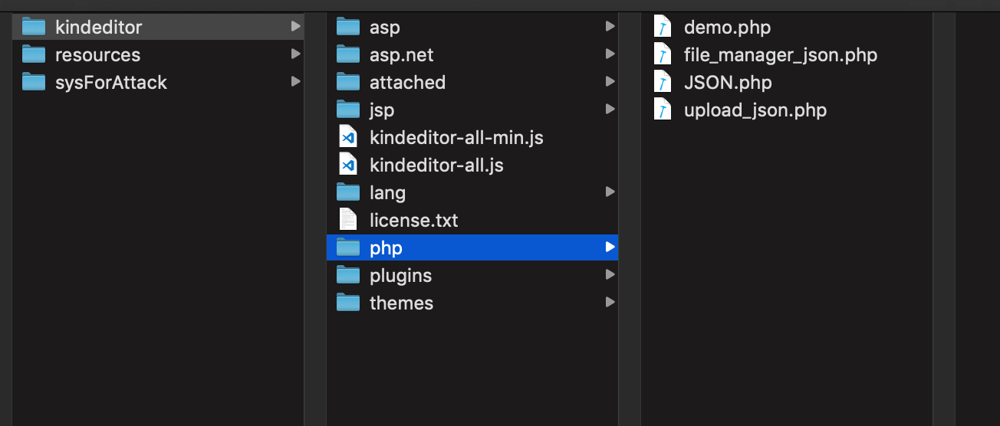
 2. In `file_manager_json.php`  source code file the `dir` and `path` parameters will cause the directory traversal vulnerability.
The biggest problem is no permission control, so anyone can use the `dir` and`path` parameters in this page.
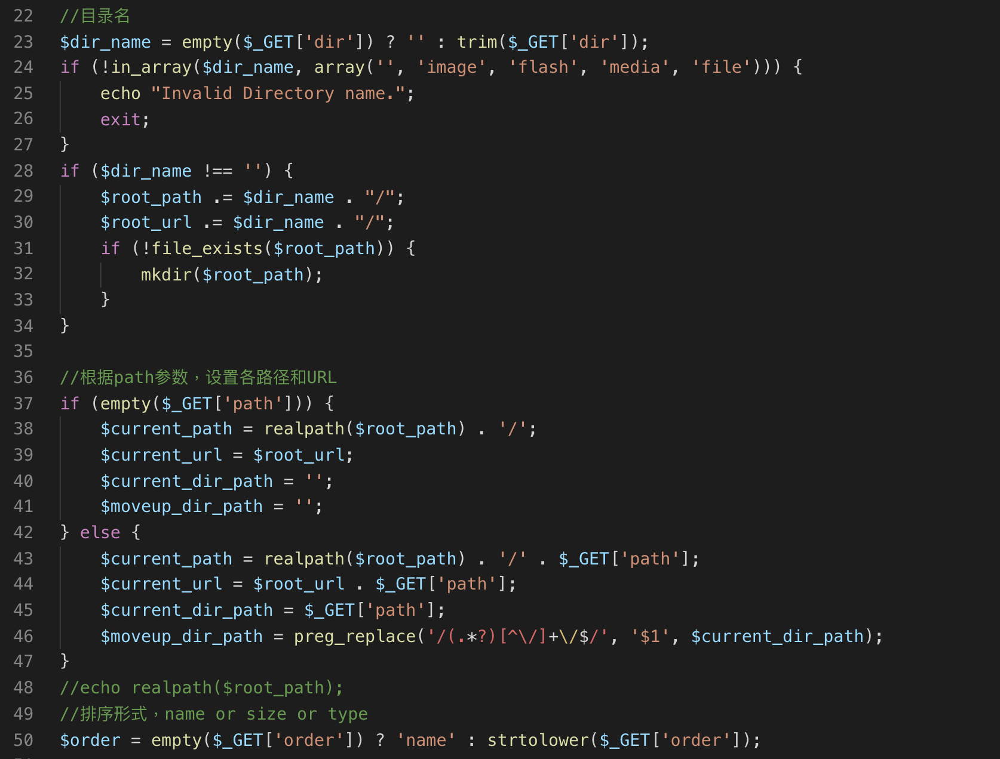
 3. Upload a `hippo2.png` picture.
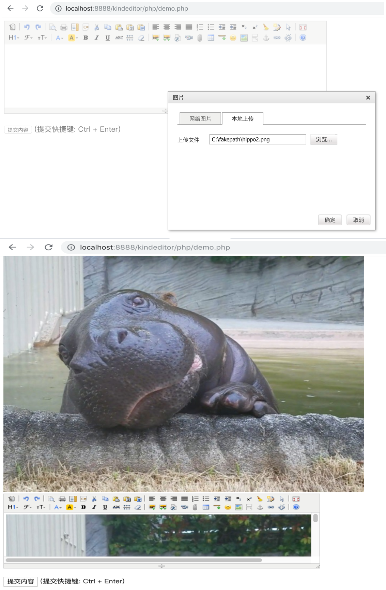
 4. Use the `dir` parameter of `file_manager_json.php` payload without any authentication, here we can see the sub-directory name is `20181009`
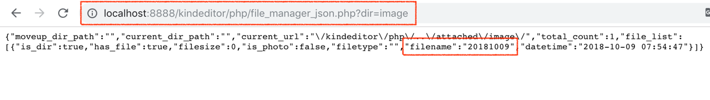
 5. Check upload folder name is match with using `dir` parameter views filename.
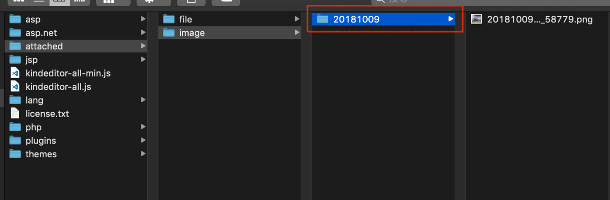
However, the `dir` parameter flexibility is too low, so we change the payload to use the `path` parameter.
 6. We successfully checked the picture filename through change payload without authentication.
Here picture filename is `20181009075447_58779.png`  
--**Payload:** `/php/file_manager_json.php?/path=/image/<Subdirectory Name>/`
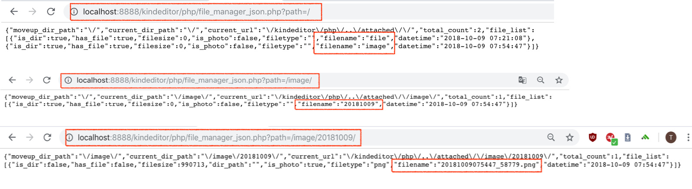
 7. The storage directory path disclosure.
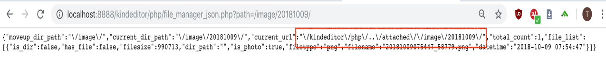
We can also find the location where the file is stored.  
--Path: `/kindeditor/attached/image/20181009/`
 8. Successfully view the picture.
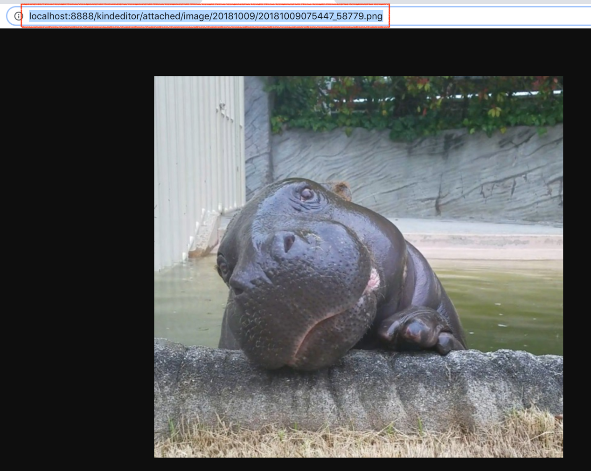

 ### Instance
 1. This is a real website.
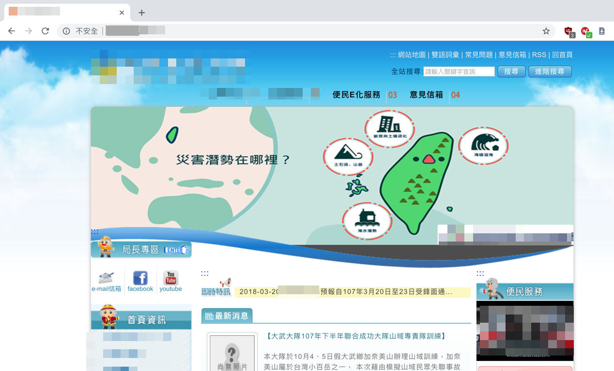
2. If you do not enter the full payload path, you will get forbidden page.
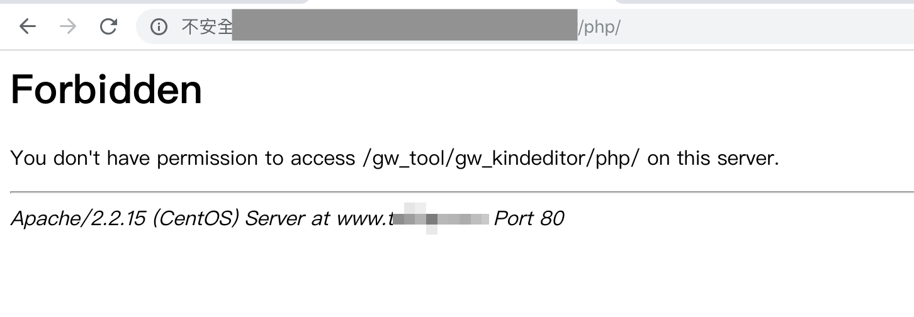
3. On this page, we typed payload without authentication by using "path" parameter.
We can quickly get target server have "file", "image", "flash" and "media" folder.
-- payload: `/php/file_manager_json.php?path=/`
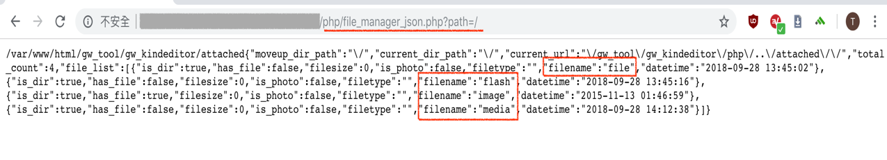
4.  We continue to typed payload for the image folder, here we get seven sub-folder filenames.
-- payload: `/php/file_manager_json.php?path=/image/`

5. We obtained all the image files name in the `20120716` sub-folder.
-- payload: `/php/file_manager_json.php?path=/image/20120716`
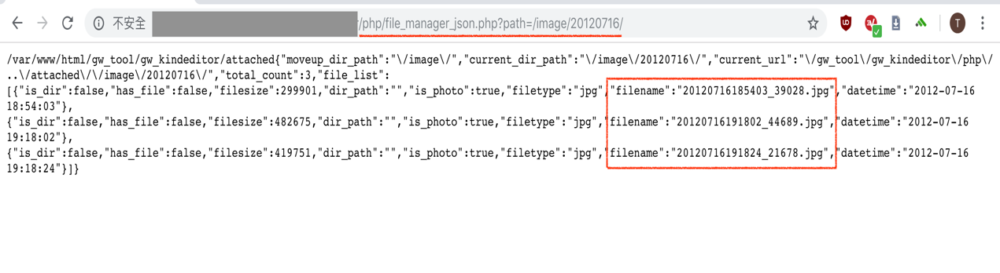
6. Get the actual location of the image.
-- path: `/gw_tool/gw_kindeditor/attached/image/20120716/20120716185403_39028.jpg`
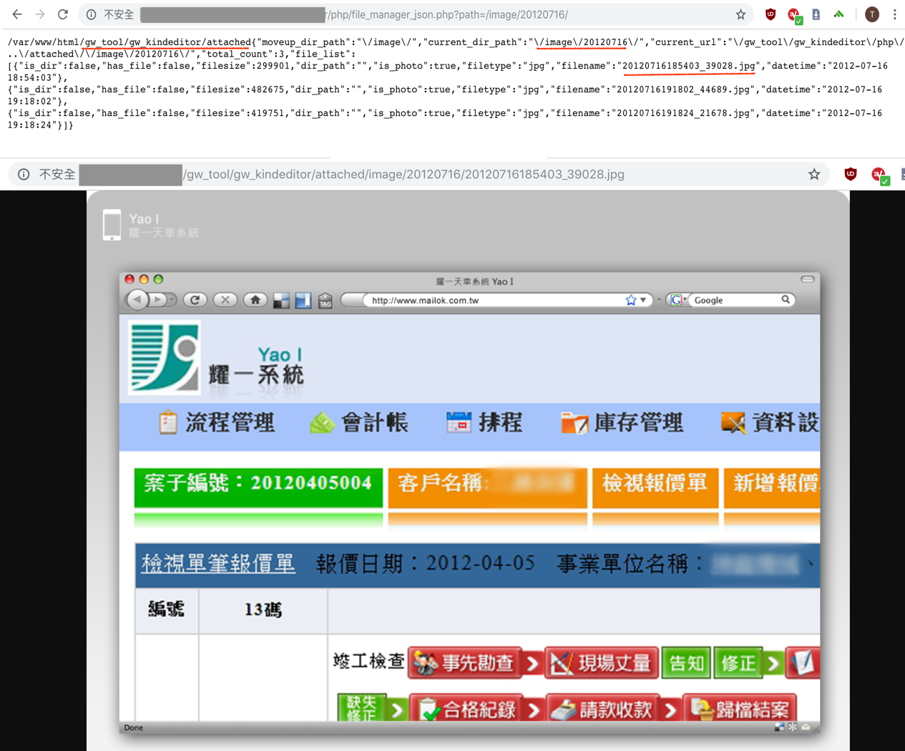

 ### Summary
From the official documents of the KindEditor, we see that there are a lot of China corporate websites using the KindEditor package, such as Huawei, Open Source China and Tudou, etc. 
If `file_manager_json.php` does not removed, through this method the unauthorized attacker can quickly view on the target host all uploaded files and exposed sensitive information.
