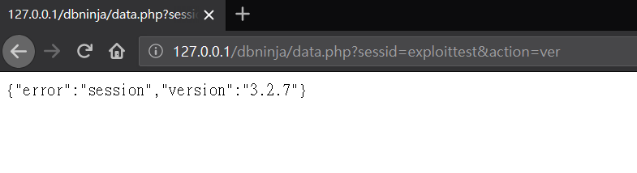
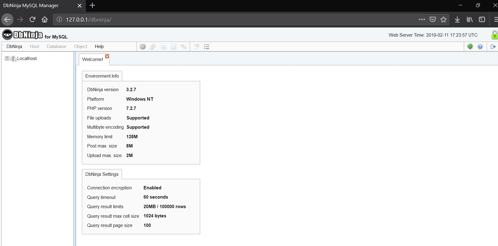
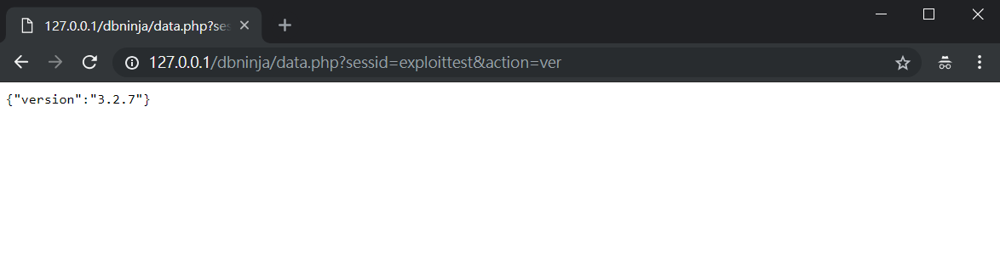

## DBNinja ver 3.2.7 Broken Authentication Vulnerability Description
- Author: YU-HSIANG HUANG, YUNG-HAO TSENG, Eddie TC CHANG
- Contact: huang.yuhsiang.phone@gmail.com; 0xuhaw@gmail.com; eddietcchang@gmail.com
---
### Testing Target
- Product: DBNinja
- Version: 3.2.7
- Official Website: https://www.dbninja.com/
- Github: N/A

### Summary
DBNinja ver 3.2.7 exist broken authentication vulnerability.

### Description
The attacker designed a URL with a specific `sessid`, if the victim browsed the URL and then logged into NinjaDB. The attacker can login to NinjaDB as the victim by using this `sessid`.
 
### Concept
1. Design a URL with a specific `sessid`, and the victim browsed the URL.  
 **Payload**: `http://127.0.0.1/dbninja/data.php?sessid=exploittest&action=ver`

2. Then the victim login as the admin account.

3. An attacker can use the victim's permission to operate DBNinja.

<!--stackedit_data:
eyJoaXN0b3J5IjpbMTg2NDg3NDA5MSwxMDkyMDMwMDI2XX0=
-->