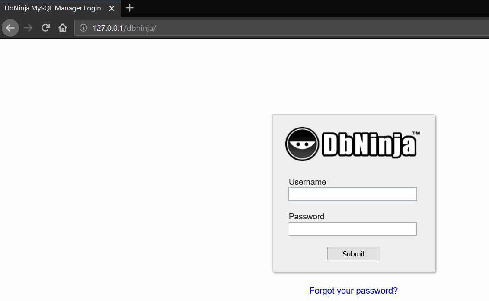
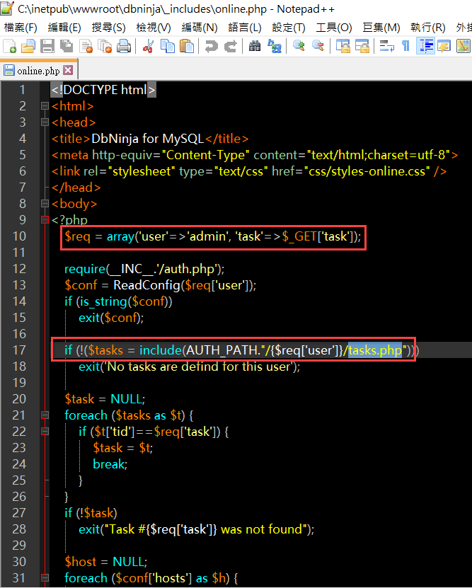
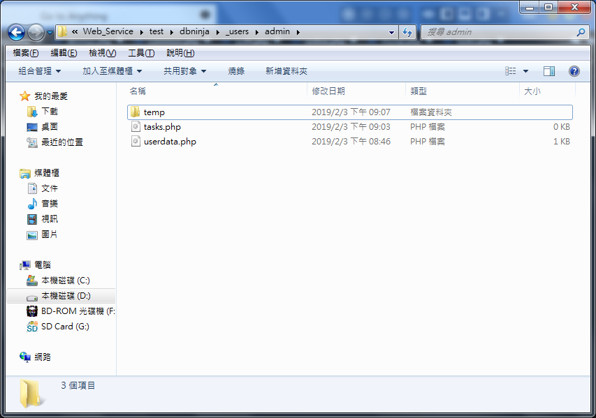

## DBNinja ver 3.2.7 Reflect Cross-Site Script (R-XSS) Vulnerability Description
- Author: Eddie TC CHANG, YUNG-HAO TSENG, YU-HSIANG HUANG
- Contact: eddietcchang@gmail.com; 0xuhaw@gmail.com; huang.yuhsiang.phone@gmail.com
---
### Testing Target
- Product: DBNinja
- Version: 3.2.7
- Official Website: https://www.dbninja.com/
- Github: N/A

### Summary
DBNinja ver 3.2.7 exist Reflect Cross-Site Script (R-XSS) and incorrect access control vulnerability.

### Description
When `\dbninja\_users\admin` folder exist `tasks.php` file, the DBNinja ver 3.2.7 could occur Reflect Cross-Site Script (R-XSS) vulnerability. In order to implement this vulnerability, need to use the `data.php` file with incorrect access control.
 
### Concept
1. Build testing environment.

2. View the source code of `\dbninja\_includes\online.php`, then observe there used parameter `task` and file `tasks.php`.

3. For exploitation, must create a file `tasks.php` in folder `\dbninja\_users\admin`.

4.	In non-login status, use following payload can implement R-XSS vulnerability. In addition to the before-mentioned problem, there is also the problem of incorrect access control in `data.php`.
 **Payload**: `http://127.0.0.1/dbninja/data.php?online=&task=`
<!--stackedit_data:
eyJoaXN0b3J5IjpbLTE5NzM1MzczNzBdfQ==
-->