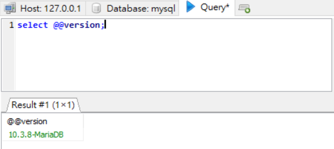
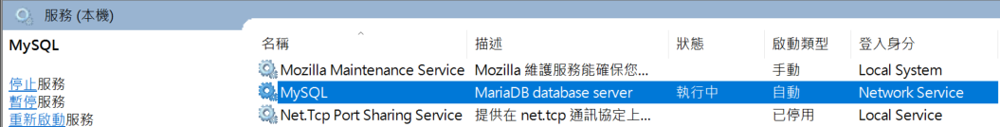
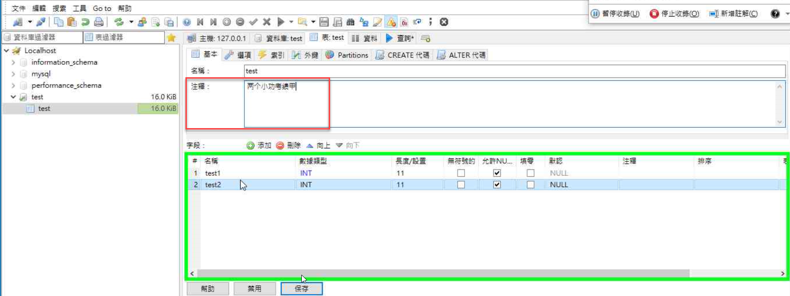
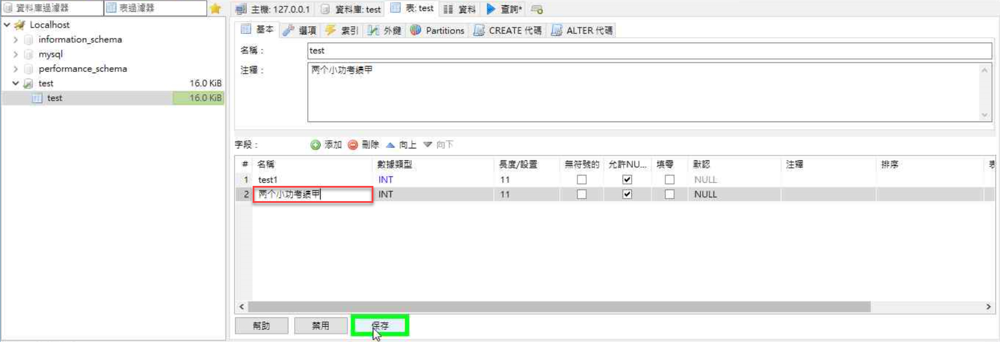
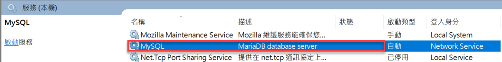

## MariaDB ver 10.3.7 and 10.3.8 has Denial of Service Vulnerability Description
- Author: YU-HSIANG HUANG, YUNG-HAO TSENG, Eddie TC CHANG
- Contact: huang.yuhsiang.phone@gmail.com; 0xuhaw@gmail.com; eddietcchang@gmail.com
---
### Testing Target
- Product: MariaDB
- Version: 10.3.7 and 10.3.8
- Official Website: https://mariadb.org/
- Github: https://github.com/MariaDB

### Summary
MariaDB version in 10.3.7 and 10.3.8 has Denial of Service (DoS) vulnerability.

### Description
We test the MariaDB 10.3.7 and 10.3.8 version exist DoS vulnerability when any user modifies column name and comment in any table at the same time.
 
### Concept
1. Confirm version of MariaDB and its running status, here we use 10.3.8.

2. Modify comment and column name at the same time, then click save.

3. Prompt error message, and MariaDB service is stop.

<!--stackedit_data:
eyJoaXN0b3J5IjpbLTE3NzYyNDU5MDAsLTIwODg3NDY2MTJdfQ
==
-->