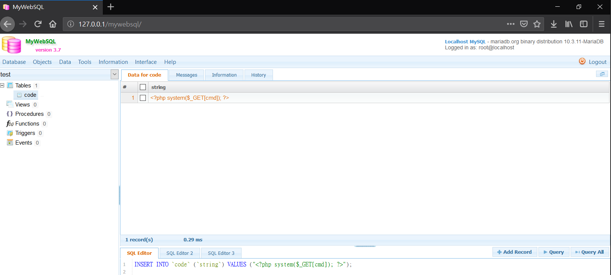
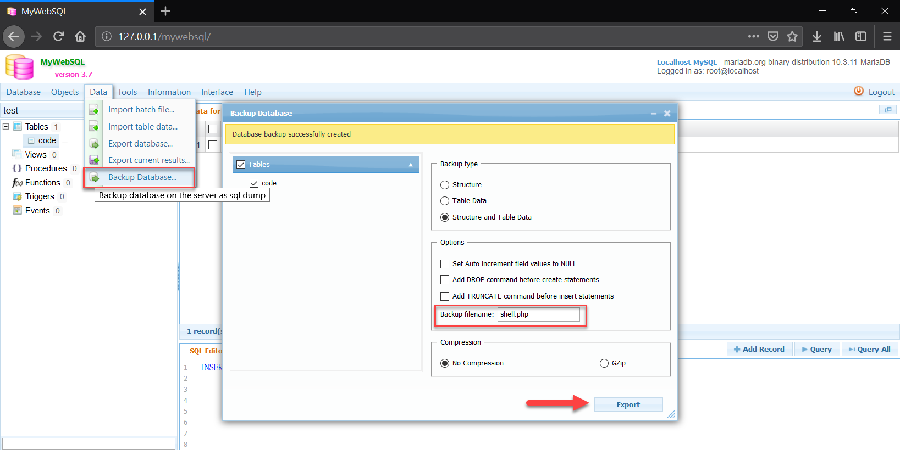
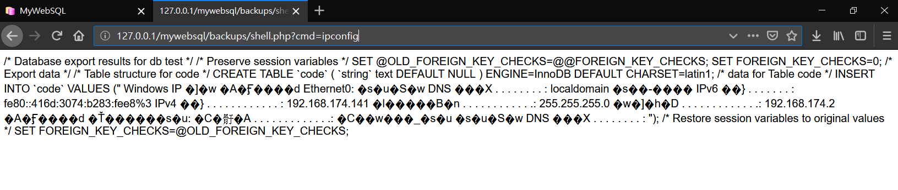

## MyWebSQL ver 3.7 remote code execution (RCE) vulnerability Description
- Author: YU-HSIANG HUANG, YUNG-HAO TSENG, Eddie TC CHANG
- Contact: huang.yuhsiang.phone@gmail.com; 0xuhaw@gmail.com; eddietcchang@gmail.com
---
### Testing Target
- Product: MyWebSQL
- Version: 3.7
- Official Website: http://mywebsql.net/
- Github: https://github.com/Samnan/MyWebSQL

### Summary
MyWebSQL version in 3.7 has remote code execution (RCE) vulnerability.

### Description
MyWebSQL version in 3.7 has remote code execution (RCE) vulnerability.
 
### Concept
1. Login by IP method, then create a test DB as below image red box.

2. Create `MyWebSQL_CSRF_PoC.html` and `MyWebSQL_PoC_iframe.html` file, that purpose is to delete the test database by CSRF.

3. Execute `MyWebSQL_CSRF_PoC.html` at another domain `chris-hpnb2`.

4.	Check result, the test DB has deleted.

<!--stackedit_data:
eyJoaXN0b3J5IjpbMTEwMjQ0NzAxOF19
-->