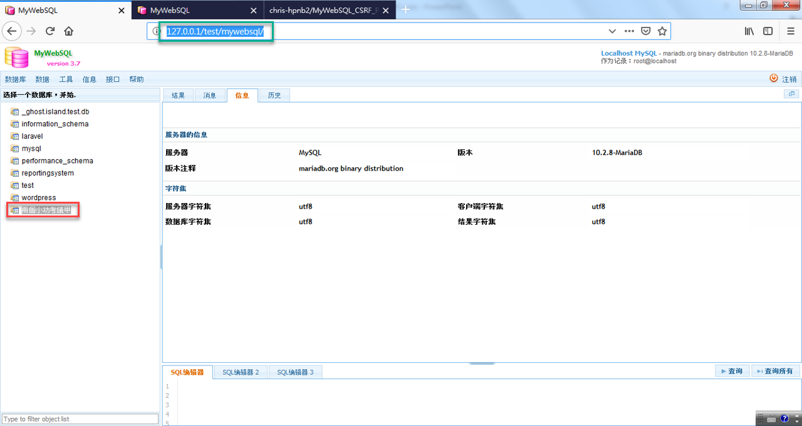
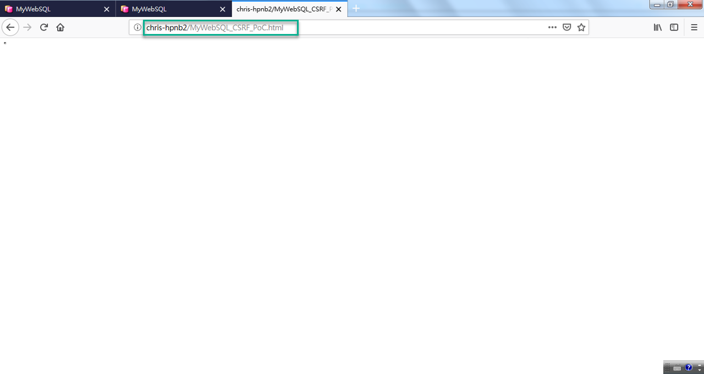

## MyWebSQL ver 3.7 Cross-site request forgery (CSRF) Vulnerability Description
- Author: YU-HSIANG HUANG, YUNG-HAO TSENG, Eddie TC CHANG
- Contact: huang.yuhsiang.phone@gmail.com; 0xuhaw@gmail.com; eddietcchang@gmail.com
---
### Testing Target
- Product: MyWebSQL
- Version: 3.7
- Official Website: https://css-tricks.com/chat2/
- Github: N/A

### Summary
The Chatv2 has SQL injection.

### Description
The `userid` parameter in `/chat2/jumpin.php` has SQL injection vulnerability.
 
### Concept
1. Build the chat2 test environment, and create a chat then send test message out.

2. Back to default page, input new desired username. Use BurpSuite to intercept POST package for sqlmap test before submitting.

3. SQL injection testing via sqlmap. Find out valid payload, then obtain web server’s information and can further enumerate DB, table or other use.
**payload:**`py -2 sqlmap.py -r D:\sql.txt -p userid --dbms mysql --level 5 --risk 3 --threads=5`

**payload:**`py -2 sqlmap.py -r D:\sql.txt -p userid --dbms mysql --level 5 --risk 3 --threads=5 -D chat2_db --tables`

<!--stackedit_data:
eyJoaXN0b3J5IjpbLTE1MDQyOTI5MTBdfQ==
-->