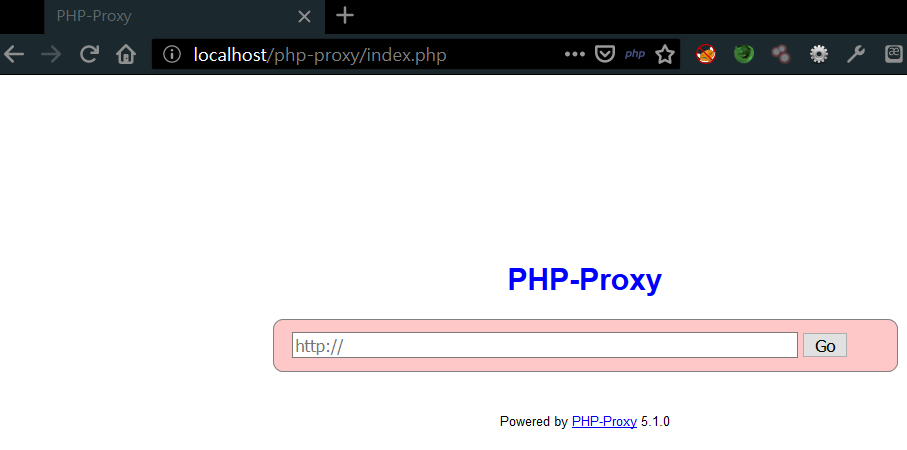
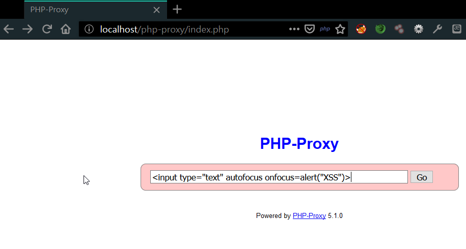
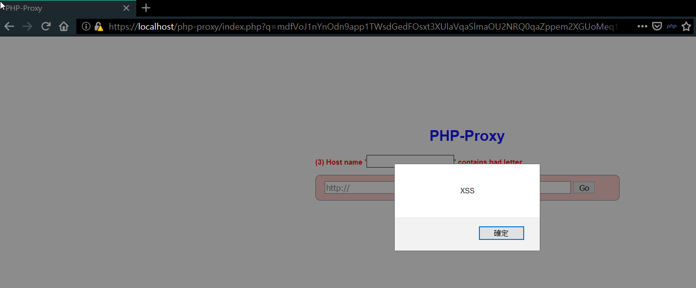
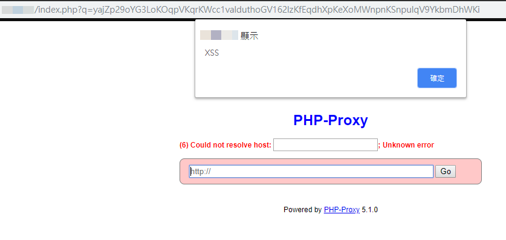
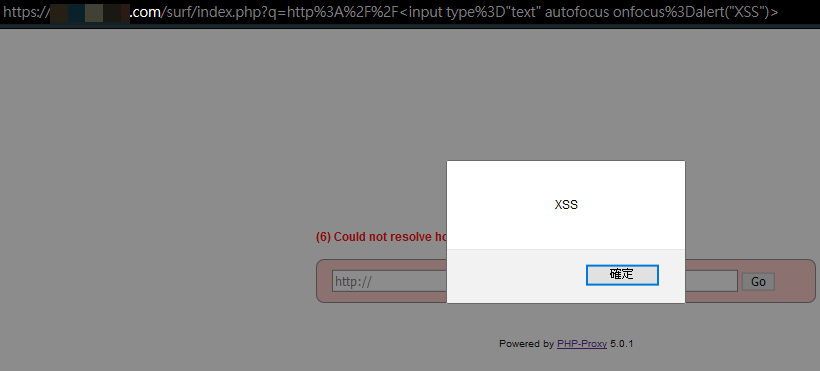
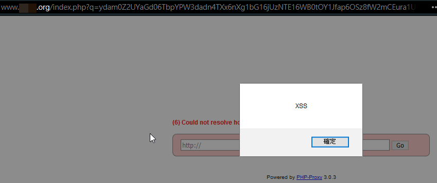

## PHP-Proxy ver<=5.1.0 have Cross-Site Scripting (XSS) Vulnerability Description
 - Author: YU-HSIANG HUANG, YUNG-HAO TSENG, Eddie TC CHANG
 - Contact: huang.yuhsiang.phone@gmail.com; 0xuhaw@gmail.com; eddietcchang@gmail.com
---
 ### Testing Target
 - Product: PHP-Proxy
 - Version: 5.1.0
 - Affect: All Version
 - Official Website: https://www.php-proxy.com/
 - Github: https://github.com/Athlon1600/php-proxy-app

 ### Abstract
PHP-Proxy before 5.1.0 has Cross-Site Scripting (XSS) via the URL field in `index.php`.
 ### Concept
 - First, we download the latest version from the official website and setup it.

 - In `/php-proxy/index.php`, only have a input field for type URL and redirect it. Then, input attack string in filed and submit.
**payload:**`<input type="text" autofocus onfocus=alert("XSS")>`

 - Show reflect XSS window.

 ### Instance
Following are actual case. 

 - ver 5.1.0

 - ver 5.0.1

 - ver 3.0.3

