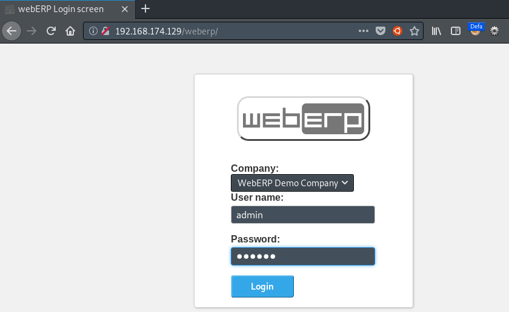
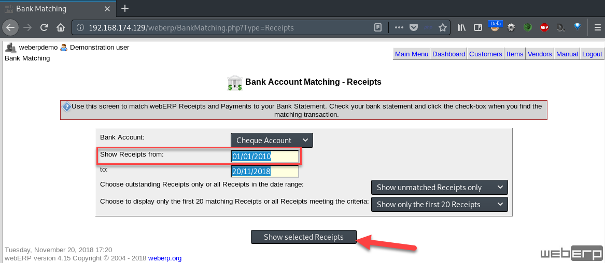
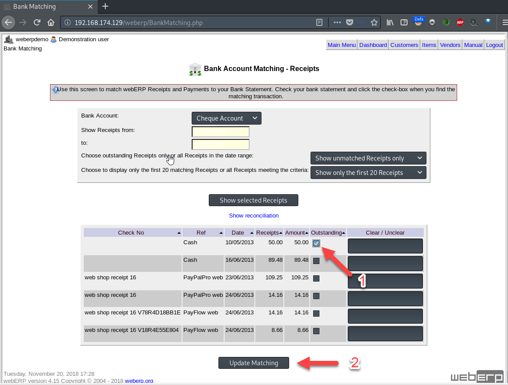
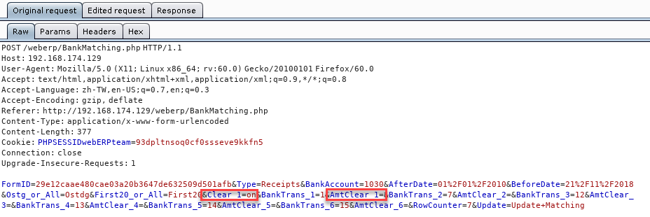
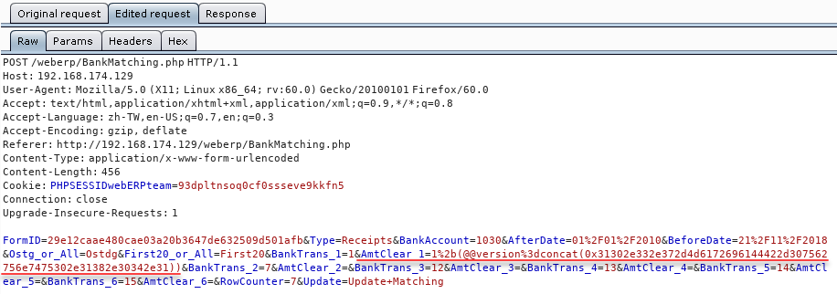
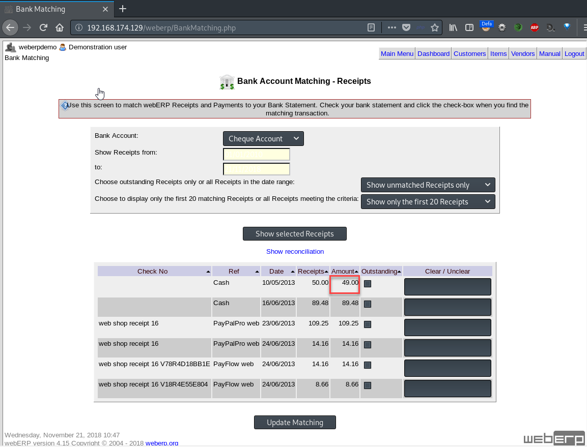
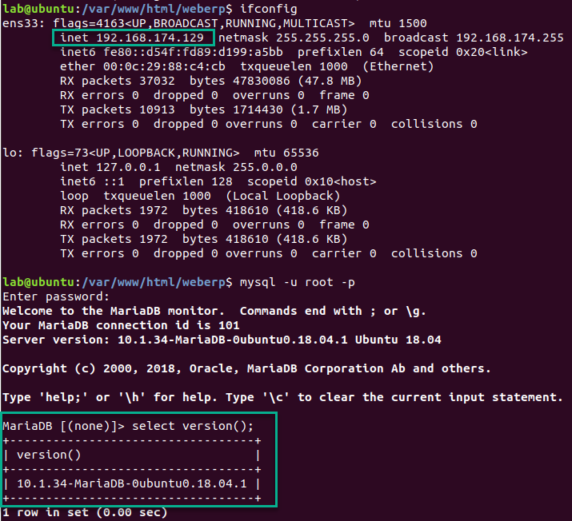

## WebERP SQL injection Vulnerability Description
 - Author: YU-HSIANG HUANG, YUNG-HAO TSENG, Eddie TC CHANG
 - Contact: huang.yuhsiang.phone@gmail.com; 0xuhaw@gmail.com; eddietcchang@gmail.com
---
 ### Testing Target
 - Product: webERP 4.15
 - Last updated: 2018/05/21
 - Official Website: http://www.weberp.org/
 - Github: https://github.com/webERP-team/webERP

 ### Abstract
The “BankMatching.php” have Blind SQL injection vulnerability in “AmtClear_” parameter, here will be to guess the database version as an example.

 ### Concept
 1. After download the latest version webERP from the official website, we review the source code of `/webERP/BankMatching.php` and speculate `AmtClear_` parameter might has blind SQL Injection vulnerability.

 2. Then, we select “webERP Demo Company” and login. (admin/weberp)

 3. “General Ledger” -> “Bank Account Receipts Matching”

 4. Adjust the “Show Receipts from” date to an earlier, make sure you can find out any item. We set this filed to "01/01/2010", and click “Show select Receipts” button.

 5. Click the first row “Outstanding” checkbox in this table and click “Update Matching”. We need to use Burp Suit tool proxy intercept function before submit.

 6. From source code can know the parameter `AmtClear_` return type might be integer, so we could make condition to do Boolean SQL injection.    
 **Payload**:    
a. Delete parameter `Clear_1=on` in POST request.    
b. Add following payload to parameter `AmtClear_1=`.    
`1+(@@version=concat(Database version present in ACSII HEX format))`    
And symbol (eg. +, =) need to do URL encode.    
If condition is TRUE will get 2 (1+1).      
If condition is FALSE will get 1 (1+0).    
In this case, the `Amount` value of row that we select is 50.00.    
=>If TRUE, the value of `Amount` will get 48 (50-2).    
=>If FALSE, the value of `Amount` will get 49 (50-1).    
We guess the database version is `10.1.34-MariaDB-0ubuntu0.18.04.1`, which ACSII HEX format is `31302e312e33342d4d6172696144422d307562756e7475302e31382e30342e31`.    
So, the payload we used is: `1%2b(@@version%3dconcat(0x31302e312e33342d4d6172696144422d307562756e7475302e31382e30342e31))`
--Original request:

--Edited request:

--Result:

Here, we can get the value of `Amount` is 48, so this database version should be `10.1.34-MariaDB-0ubuntu0.18.04.1`.
7. In addition, we guess a wrong database version. For example is `10.3.7-MariaDB-0ubuntu0.18.04.1`, which ACSII HEX format is `31302e332e372d4d6172696144422d307562756e7475302e31382e30342e31`. 
So, the payload we used is: `1%2b(@@version%3dconcat(0x31302e332e372d4d6172696144422d307562756e7475302e31382e30342e31))`
--Original request:

--Edited request:

--Result:

Here, we can get the value of `Amount` is 49, the condition is false. So, the database version is not `10.3.7-MariaDB-0ubuntu0.18.04.1`.
 8. Check the database version in web server.

