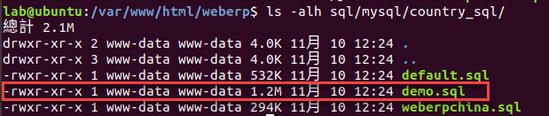
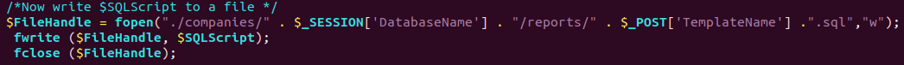
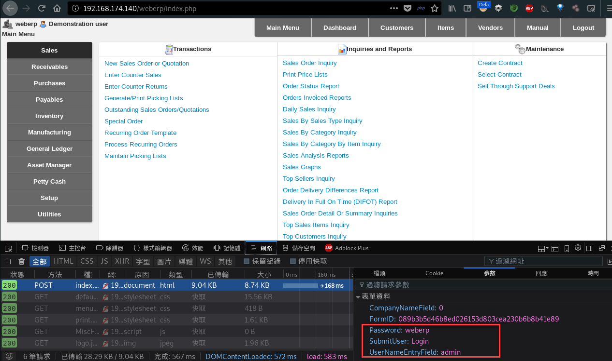
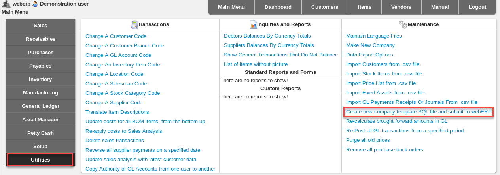
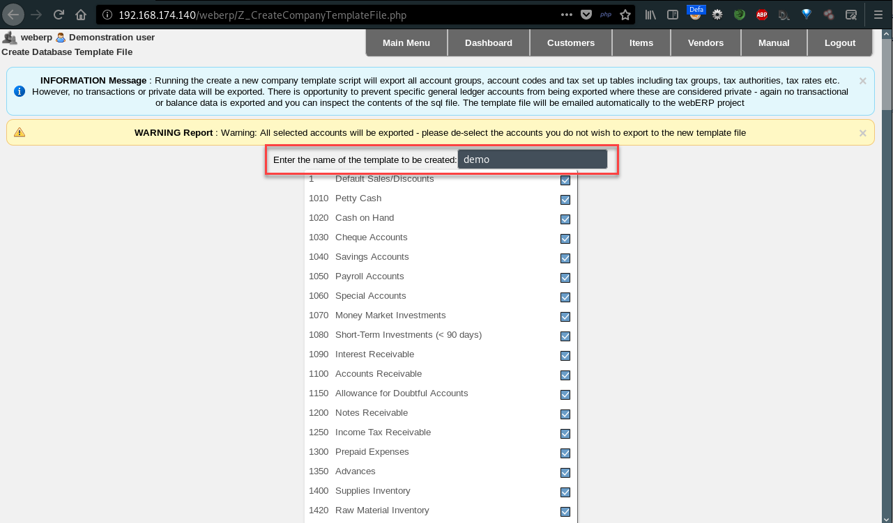
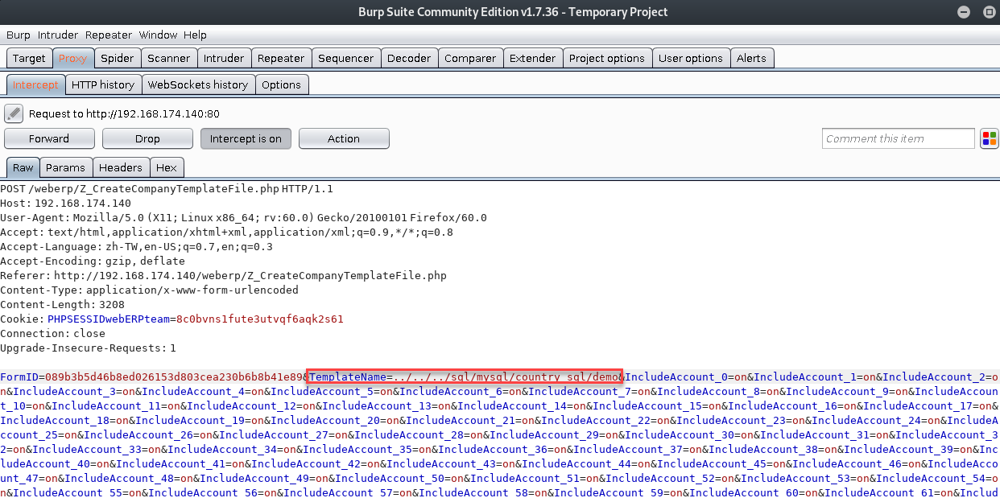

## WebERP v4.15 Incorrect Access Control Description
 - Author: YU-HSIANG HUANG, YUNG-HAO TSENG, Eddie TC CHANG
 - Contact: huang.yuhsiang.phone@gmail.com; 0xuhaw@gmail.com; eddietcchang@gmail.com
---
 ### Testing Target
 - Product: webERP 4.15
 - Last updated: 2018/05/21
 - Official Website: http://www.weberp.org/
 - Github: https://github.com/webERP-team/webERP

 ### Summary
The `Z_CreateCompanyTemplateFile.php` have Incorrect Access Control vulnerability that could overwrite existing SQL file at the target web.

 ### Concept
 1. Assume we want to overwrite the `/weberp/sql/mysql/country_sql/demo.sql`. Here can see the target file size is 1.2MB.

 2. View the source code of `Z_CreateCompanyTemplateFile.php`, we can know the original location that create new SQL file should under the `/weberp/companies/(DatabaseName)/reports/` path.

 3.	So, we select `WebERP Demo Company` and user/password is `admin/weberp` to login, then click `Utilities->Create new company template SQL file and submit to webERP`.

 4. Because of we want to overwrite the SQL file which name is `demo`, we input `demo` in the field.

 5. We set the BurpSuite to intercept packet before submit, then click `Create Template and Email` button and edit value of parameter `TemplateName`.  
 **Payload**: `../../../sql/mysql/country_sql/demo`

 6. Check the `/weberp/sql/mysql/country_sql/demo.sql` file size. Here can see the target file size is changed.(From 1.2M to 44K)

